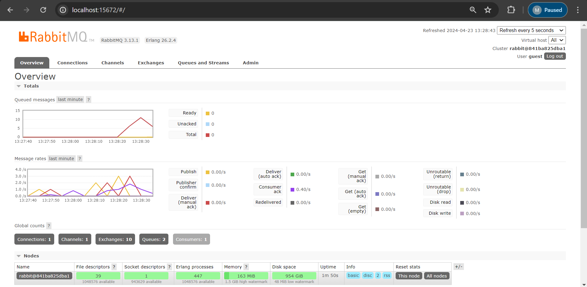
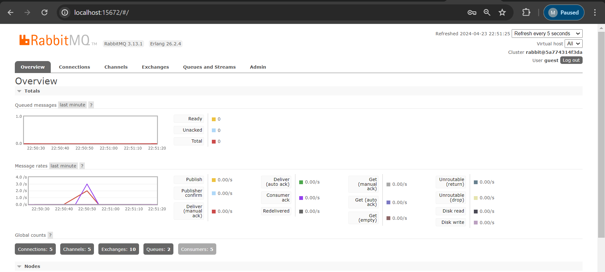

# advprog-module8-subscriber

Reflection 1

1. AMQP (Advanced Message Queuing Protocol) adalah protokol yang digunakan untuk mengirim dan menerima pesan antara dua aplikasi atau lebih. AMQP adalah protokol yang terbuka, asinkron, dan berbasis pesan. AMQP memungkinkan aplikasi untuk berkomunikasi dengan cara yang aman dan efisien.

2. guest:guest@localhost:5672 adalah format umum untuk koneksi ke server yang biasanya digunakan dalam konteks penggunaan broker pesan seperti RabbitMQ. guest:guest adalah username dan password yang digunakan untuk mengakses server RabbitMQ. localhost:5672 adalah alamat server RabbitMQ. Localhost adalah alamat IP dari server RabbitMQ, sedangkan 5672 adalah port yang digunakan oleh server RabbitMQ.

# Screenshoot

Pada gambar interface rabbitMQ saya terdapat 10 queued message karena saya melambankan proses subscriber dalam menerima data dari message broker dengan delay 1 detik.

Pada kali ini queued message menjadi 0 karena pada kali ini saya menjalankan lebih dari satu subscriber. Dapat kita lihat bahwa dengan menjalankan lebih dari satu subscriber, distribusi pesan menjadi lebih cepat.